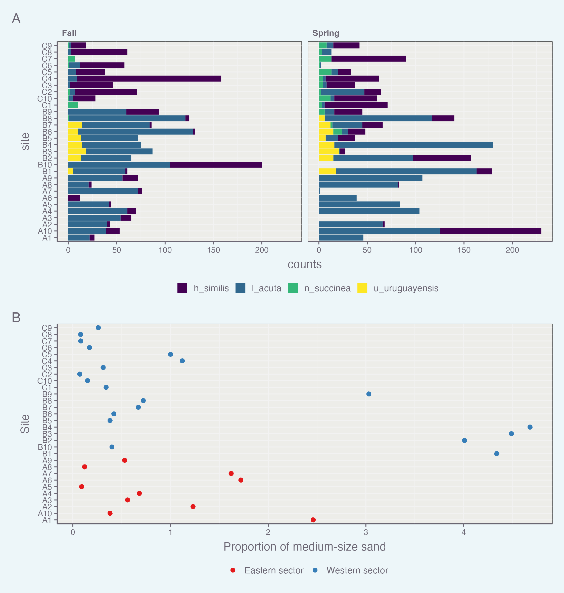

# Week 08 - Homework   More ggplot

Welcome to your assignment for **week 8**. As usual, **Clone** this repo into your own :computer: using RStudio, as we saw in class.

This week we will work with the **Argentina data**[1](https://www.springer.com/gp/book/9780387459677) that we saw in class. This data consists of series of counts for different benthic species found in inter-tidal areas. The data set contains species counts for a number of sites as well as measures of different variables discribing those sites, including the location of the site in the inter-tidal channel as well as sediment characteristics.

For this week's assignment you will need to create a short **"report" in an RMarkdown** format with its associated `.md` and `.html` outputs (i.e. you will need to *knit it* at the end). In this report you will guide me through the process of reproducing the following figure. Feel free to add as much text as you want explaining your steps.

<!-- -->

**IMPORTANT**: as mentioned in class this is not quite a replication challenge. This week you will need to create your own ggplot theme that you will apply to all future assignments (minor edits are allowed as we progress). So, for this week, the contents of the figure above need to be the same, however, the theme and *look* of the figure need to be specific to you.

## wrap-up

In addition to being shown in the final report, each figure should be saved in `.pdf` format with a width of 190 mm

Finally, once you have completed the exercises, as usual:

-   Once you are done with the R markdown file, save the changes, and make sure it is properly saved in a folder named **Rmarkdown**.
-   Commit all the changes to the *repo/R project* (remember to write a commit message!)
-   **Push** all changes back to **GitHub**
-   Go to GitHub and check that it all worked out

## A few hints

-   You will notice that the figure is made of two panels. These panels are completely different plots (i.e. you cannot make them via `facet_wrap()` or similar. You will need to use the tools sen in clase to combine two plots.

As always, feel free to use the [Homework Issues](https://github.com/orgs/UM-R-for-EnvSci-Fall-2022/discussions/categories/homework-issues) section of the [discussion](https://github.com/orgs/UM-R-for-EnvSci-Fall-2022/discussions) section to reach out to your classmates if you have any questions. Remember that this is a way to practice how to engage in something like Stack Overflow or similar. I will be monitoring it, and if you are not getting any help, I'll jump in! Remember you can always tag me or any classmate in a comment for quicker replies!

*Happy coding!*

Pepe
