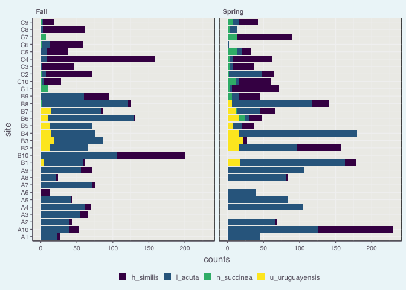
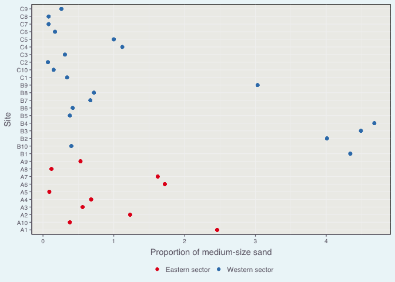
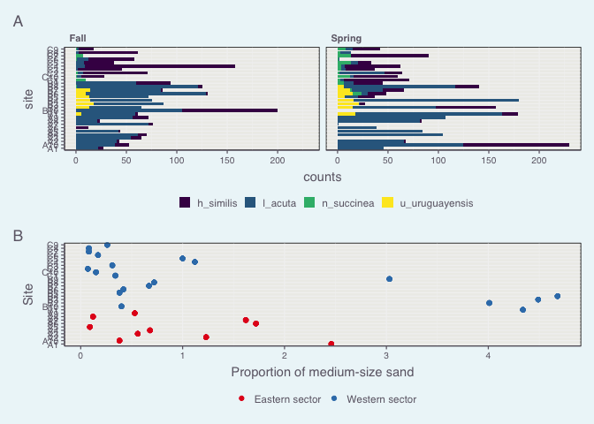

```r
library(tidyverse)
```

```
## ── Attaching packages ─────────────────────────────────────── tidyverse 1.3.2 ──
## ✔ ggplot2 3.3.6      ✔ purrr   0.3.5 
## ✔ tibble  3.1.8      ✔ dplyr   1.0.10
## ✔ tidyr   1.2.1      ✔ stringr 1.4.1 
## ✔ readr   2.1.3      ✔ forcats 0.5.2 
## ── Conflicts ────────────────────────────────────────── tidyverse_conflicts() ──
## ✖ dplyr::filter() masks stats::filter()
## ✖ dplyr::lag()    masks stats::lag()
```

```r
library(janitor)
```

```
## 
## Attaching package: 'janitor'
## 
## The following objects are masked from 'package:stats':
## 
##     chisq.test, fisher.test
```

```r
library(here)
```

```
## here() starts at /Users/pepe/Dropbox/Postdoc/03_ELA/Teaching/UofM/R course/R Course - 2022/Homework/aaa_solutions/wk08-hw-solutions
```

```r
library(viridis)
```

```
## Loading required package: viridisLite
```

```r
library(patchwork)
```

# Theme


```r
source(here("functions", "theme_pepe_week_8.r"))

theme_set(theme_pepe_week_8())  #Sets the theme for all ggplot plots in this .Rmd file (no need to call it in the plot itself)
```


# Data


```r
argentina_data_original <- read_delim(here("data", "argentina_data_homework.txt"))
```

```
## Rows: 60 Columns: 12
## ── Column specification ────────────────────────────────────────────────────────
## Delimiter: ","
## chr (3): Site, Season, TransectLocation
## dbl (9): L.acuta, H.similis, U.uruguayensis, N.succinea, MedSand, FineSand, ...
## 
## ℹ Use `spec()` to retrieve the full column specification for this data.
## ℹ Specify the column types or set `show_col_types = FALSE` to quiet this message.
```

```r
argentina_data_original
```

```
## # A tibble: 60 × 12
##    Site  L.acuta H.similis U.urug…¹ N.suc…² MedSand FineS…³   Mud Organ…⁴ Season
##    <chr>   <dbl>     <dbl>    <dbl>   <dbl>   <dbl>   <dbl> <dbl>   <dbl> <chr> 
##  1 A1         22         5        0       0    2.46    72.2  25.4    6.59 Fall  
##  2 A2         40         3        0       0    1.23    70    28.8    6.6  Fall  
##  3 A3         54        11        0       0    0.56    67.4  32      6.48 Fall  
##  4 A4         61         9        0       0    0.68    73.5  25.9    5.92 Fall  
##  5 A5         42         2        0       0    0.09    77.4  22.5    5.94 Fall  
##  6 A6          0        12        0       0    1.72    77.3  21.0    5.37 Fall  
##  7 A7         72         4        0       0    1.62    74.0  24.4    6.25 Fall  
##  8 A8         21         3        0       0    0.12    71.8  28.1    5.38 Fall  
##  9 A9         56        16        0       0    0.53    83.8  25.7    6.07 Fall  
## 10 A10        39        14        0       0    0.38    68.2  31.4    6.88 Fall  
## # … with 50 more rows, 2 more variables: Transect <dbl>,
## #   TransectLocation <chr>, and abbreviated variable names ¹​U.uruguayensis,
## #   ²​N.succinea, ³​FineSand, ⁴​OrganMat
```


# Data processing


```r
argentina_data <- argentina_data_original %>% 
  clean_names() %>% 
  pivot_longer(cols = c(l_acuta, h_similis, u_uruguayensis, n_succinea), 
               names_to = "species",
               values_to = "counts")


argentina_data
```

```
## # A tibble: 240 × 10
##    site  med_sand fine_sand   mud organ_…¹ season trans…² trans…³ species counts
##    <chr>    <dbl>     <dbl> <dbl>    <dbl> <chr>    <dbl> <chr>   <chr>    <dbl>
##  1 A1        2.46      72.2  25.4     6.59 Fall         1 Easter… l_acuta     22
##  2 A1        2.46      72.2  25.4     6.59 Fall         1 Easter… h_simi…      5
##  3 A1        2.46      72.2  25.4     6.59 Fall         1 Easter… u_urug…      0
##  4 A1        2.46      72.2  25.4     6.59 Fall         1 Easter… n_succ…      0
##  5 A2        1.23      70    28.8     6.6  Fall         1 Easter… l_acuta     40
##  6 A2        1.23      70    28.8     6.6  Fall         1 Easter… h_simi…      3
##  7 A2        1.23      70    28.8     6.6  Fall         1 Easter… u_urug…      0
##  8 A2        1.23      70    28.8     6.6  Fall         1 Easter… n_succ…      0
##  9 A3        0.56      67.4  32       6.48 Fall         1 Easter… l_acuta     54
## 10 A3        0.56      67.4  32       6.48 Fall         1 Easter… h_simi…     11
## # … with 230 more rows, and abbreviated variable names ¹​organ_mat, ²​transect,
## #   ³​transect_location
```


# Plot


```r
argentina_species_plot <- argentina_data %>% 
  ggplot +
  facet_wrap(~season) +
  geom_col(aes(x = counts, y = site, fill = species)) +
  scale_fill_viridis(discrete = TRUE) +
  theme(legend.position = "bottom")
  


argentina_species_plot
```

<!-- -->


```r
argentina_sand_plot <- argentina_data %>% 
  ggplot +
  # facet_wrap(~season) +
  geom_point(aes(x = med_sand, y = site, colour = transect_location)) +
  scale_colour_brewer(palette = "Set1") +
  theme(legend.position = "bottom") +
  labs(x = "Proportion of medium-size sand",
       y = "Site")


argentina_sand_plot
```

<!-- -->


```r
combined_plot <- argentina_species_plot + argentina_sand_plot +
   plot_layout(ncol = 1) +             # You can specify the number of columns and rows
  plot_annotation(tag_levels = c('A', '1'))
  
  
combined_plot
```

<!-- -->


```r
ggsave(here("figures/figures_to_replicate/argentina_figure.png"), combined_plot, width = 190, height = 200, units = "mm")
```


